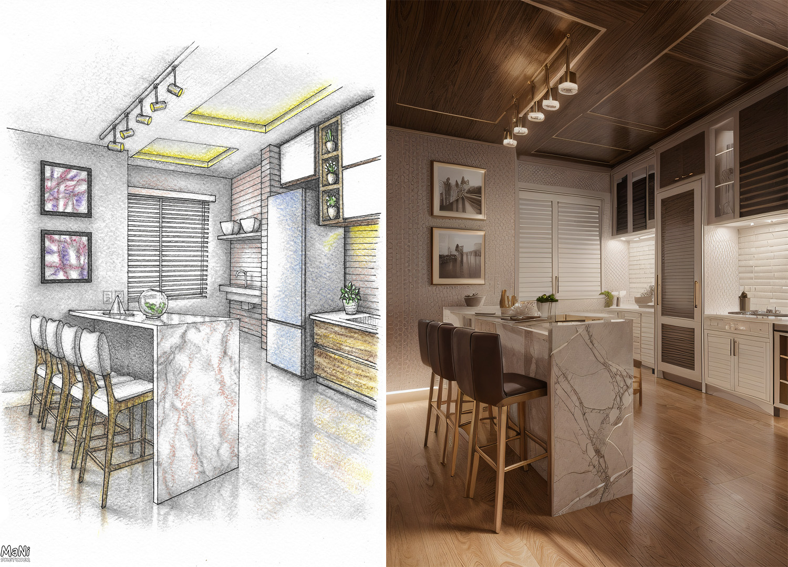
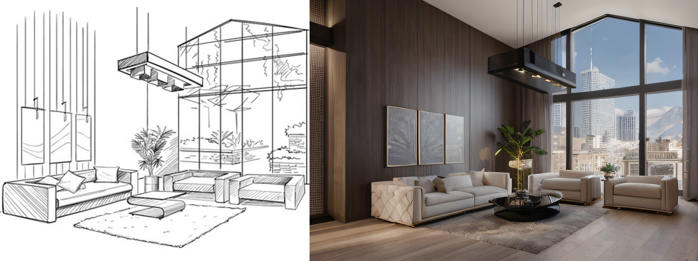
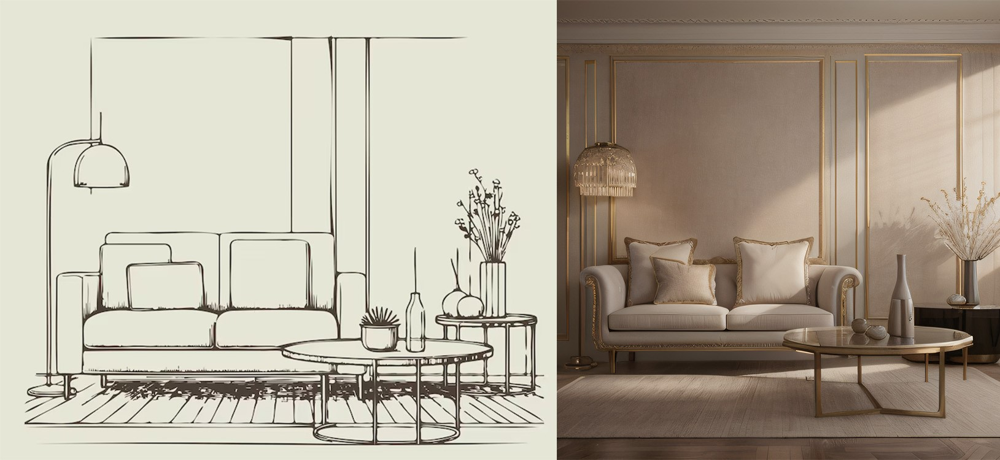
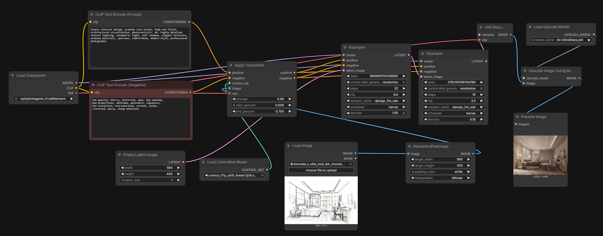

# ComfyUI Sketch → Interior Render

Workflow for converting architectural sketches into photorealistic interior renders using Stable Diffusion and ControlNet.

## Example

Comparison:

  

---

## Workflow

---

## Features

- Sketch → photorealistic interior render
- ControlNet Lineart guidance
- Optional Canny preprocessing
- Latent upscale detail pass
- 4x UltraSharp final upscale

---

## Requirements

- ComfyUI
- Stable Diffusion 1.5
- ControlNet Lineart
- ControlNet Canny (optional)

---

## Models used

Checkpoint

- epiCPhotoGasm V1

ControlNet

- control_v11p_sd15_lineart
- control_v11p_sd15_canny

Upscale

- 4x-UltraSharp

---

## Usage

1. Load the workflow JSON in ComfyUI
2. Insert your sketch image
3. Run the pipeline
4. Get a photorealistic interior render

---

## Goal

Preserve the spatial structure of architectural sketches while producing photorealistic interior visualization.
